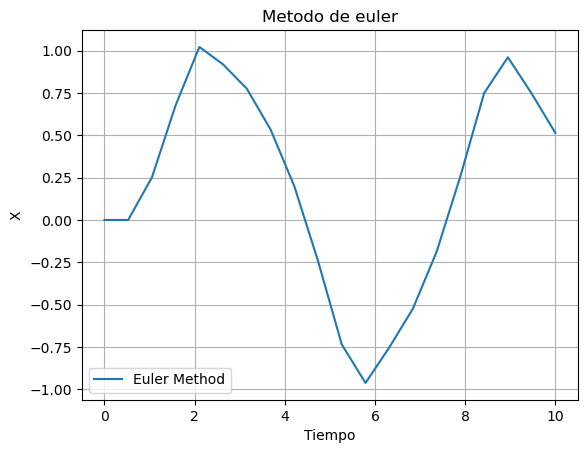
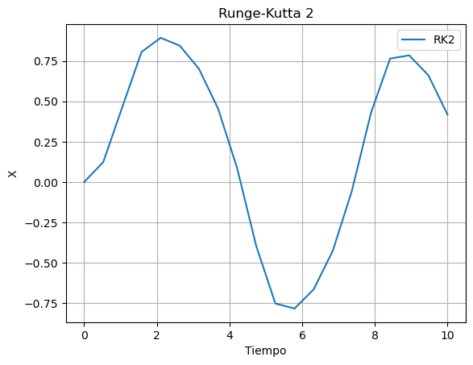
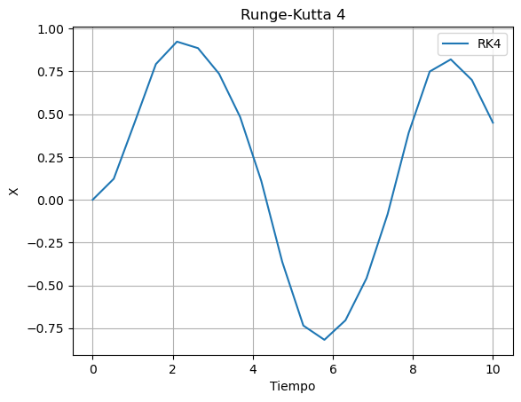

## Ejemplos de funciones hechas por los distintos metodos
 Todas los metodos intentaron aproximar la funcion con 20 iteraciones
 $$ \frac{dx}{dt}  = -x^{3} + \sin(t) $$

Grafica para la funcion obtenida con el metodo de euler
    

Grafica para la funcion obtenida con el metodo de RK de segundo orden
    

Grafica para la funcion obtenida con el metodo de RK de cuarto orden
    

